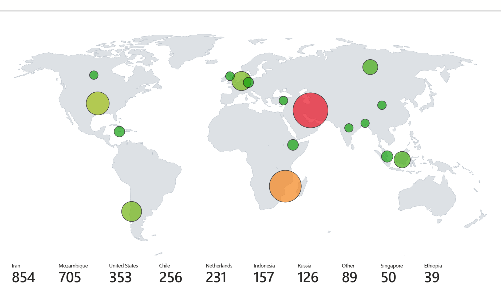
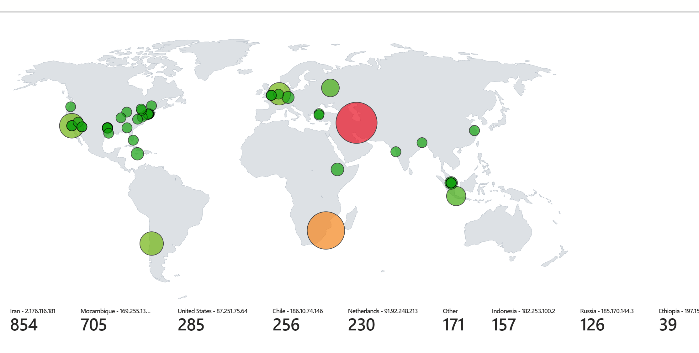

<h2>Goals:</h2>
Gain more hands-on experience with:

	- Azure
	- Firewall Configuration
	- Log analysis
	- Miscellaneous tools and data visualization features within Azure
	- Powershell
	- APIs

<h2>Summary:</h2>
Initialized a virtual machine on Azure and configure Microsoft firewall settings to allow all requests from any source IP. Configured Microsoft Sentinel to log all incoming requests. Utilized powershell to connect to ipgeolocation.io's API, feed in source IP addresses that attempted to access the VM, retrieve geolocation data on those IPs, and appended the processed logs into a new log file. Used the log file as input to visualize where attacks were primarily originating from in the form of a bubble map.

<h2>Low quality iPhone video of the logs being analyzed:</h2>

<h2>Bubble Maps:</h2>

<h2>Geolocated IP log file:</h2>
I've added my IPgeo log file for anyone who wants to mess around with the log data as well :)
<a href="https://github.com/LGTJackson/Azure-Honeypot/edit/main/failed_rdp.log">
